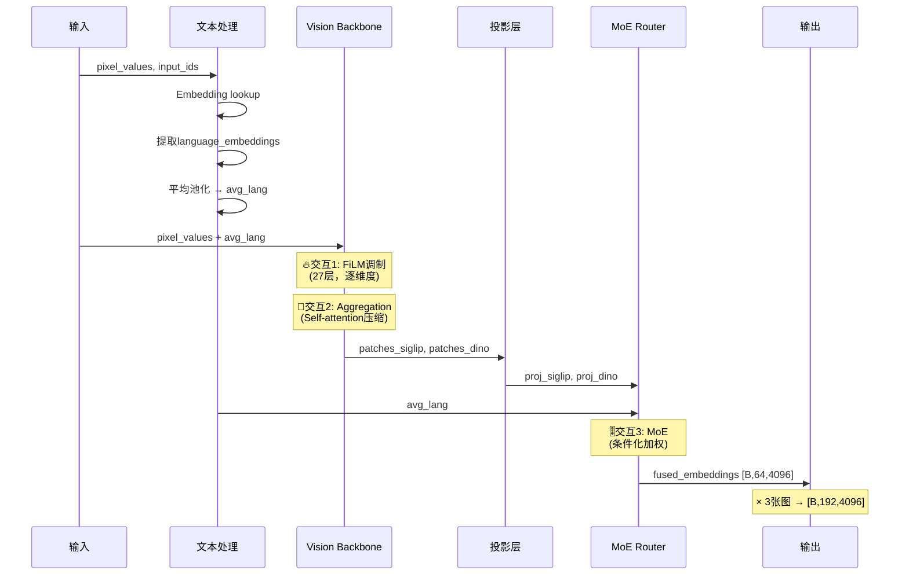

# 🔄 CogVLA 视觉-语言交互完整流程

> 从输入到输出：3次关键交互的完整解析

---

## 📋 目录

1. [流程概览](#流程概览)
2. [第0步：输入准备](#第0步输入准备)
3. [第1步：文本预处理（无交互）](#第1步文本预处理)
4. [交互1：FiLM调制（深度交互）](#交互1film调制)
5. [交互2：Aggregation Tokens（间接交互）](#交互2aggregation-tokens)
6. [第2步：特征投影（无交互）](#第2步特征投影)
7. [交互3：MoE Router（条件化）](#交互3moe-router)
8. [第3步：多模态序列构建](#第3步多模态序列构建)
9. [完整数据流总结](#完整数据流总结)

---

## 🎯 流程概览

**一句话总结**：文本指令通过3次不同机制与视觉特征交互，最终形成融合的多模态表示。

```
输入: 图像 + 文本指令
  ↓
[交互1] FiLM调制 → 文本动态调整视觉特征（27层，逐元素）
  ↓
[交互2] Aggregation Tokens → 压缩视觉信息（在FiLM影响下）
  ↓
[交互3] MoE Router → 文本决定专家权重（全局加权）
  ↓
输出: 融合的视觉tokens [B, 192, 4096]
```

---

## 第0步：输入准备

### 输入数据

```python
# 图像输入
pixel_values: [B, 18, 224, 224]  
# 18通道 = 3张图 × (SigLIP 3ch + DINOv2 3ch)

# 文本输入
input_ids: [B, seq_len]  
# 例如: "pick up the red cube" → token IDs
```

### 代码位置
`prismatic/extern/hf/modeling_prismatic.py:655-667`

---

## 第1步：文本预处理

### 操作：提取语言embeddings

**代码**：
```python
# 1.1 Embedding lookup
input_embeddings = self.get_input_embeddings()(input_ids)  
# [B, seq_len, 4096]

# 1.2 分离语言和动作部分
all_actions_mask = self._process_action_masks(labels)
language_embeddings = input_embeddings[~all_actions_mask].reshape(
    input_embeddings.shape[0], -1, input_embeddings.shape[2]
)  # [B, lang_seq_len, 4096]

# 1.3 平均池化
avg_lang = language_embeddings.mean(dim=1)  # [B, 4096]
```

### 示例

```python
# 输入: "pick up the red cube"
input_ids:           [1, 5839, 701, 278, 2654, 28704, ...]
                     ↓ embedding lookup
input_embeddings:    [B, 20, 4096]
                     ↓ 移除动作部分
language_embeddings: [B, 6, 4096]  # 只保留文本
                     ↓ 平均池化
avg_lang:            [B, 4096]  # 全局语义向量
```

### 关键输出

| 变量 | 形状 | 用途 |
|------|------|------|
| `language_embeddings` | [B, lang_len, 4096] | 用于FiLM调制（部分实现） |
| `avg_lang` | [B, 4096] | 用于FiLM + MoE Router |

**代码位置**：`modeling_prismatic.py:659-667`

---

## 交互1：FiLM调制

### 🔥 类型：深度特征级交互

### 发生位置
Vision Backbone内部（SigLIP & DINOv2 ViT的每一层）

### 机制原理

```python
# 在每个ViT的每一层（共27层）
def forward(self, x, average_language_embedding):
    # 步骤1: 文本 → 调制参数
    gamma = self.scale(average_language_embedding)  # [B, 4096]→[B, 1024]
    beta = self.shift(average_language_embedding)   # [B, 4096]→[B, 1024]
    
    # 步骤2: 标准 Attention
    x = x + self.attn(self.norm1(x))
    
    # 步骤3: FiLM 调制（关键！）
    x = x * (1 + gamma.view(B, 1, -1)) + beta.view(B, 1, -1)
    #   ↑     ↑ 缩放因子               ↑ 偏移量
    # 原始    文本调制                  文本调制
    
    # 步骤4: MLP
    x = x + self.mlp(self.norm2(x))
    return x
```

### 数学公式

$$
\mathbf{x}_{\text{new}} = \mathbf{x}_{\text{old}} \odot (1 + \gamma(\text{avg\_lang})) + \beta(\text{avg\_lang})
$$

- $\gamma, \beta$: 从文本生成的可学习参数（通过MLP）
- $\odot$: 逐元素乘法

### 详细示例

```python
# 指令: "pick up the red cube"
avg_lang = [0.2, 0.5, -0.1, ...]  # [B, 4096]

# 通过MLP生成调制参数
gamma = MLP_scale(avg_lang)  # [0.5, -0.2, 0.8, ...]  [B, 1024]
beta = MLP_shift(avg_lang)   # [0.1, 0.05, -0.1, ...] [B, 1024]

# 对视觉特征 x 的每个维度
x_old = [2.0, 1.5, 0.3, ...]  # [B, 320, 1024]

# 逐元素调制
x_new[0] = 2.0 * (1 + 0.5) + 0.1   = 3.1   # 放大红色相关维度
x_new[1] = 1.5 * (1 - 0.2) + 0.05  = 1.25  # 抑制无关维度
x_new[2] = 0.3 * (1 + 0.8) - 0.1   = 0.44  # 调整形状维度
```

### 特点

| 维度 | 说明 |
|------|------|
| **交互深度** | 深度交互 ✅ |
| **作用层数** | 27层（每层都调制） |
| **粒度** | Per-dimension（1024维） |
| **信息流** | 单向：文本 → 视觉 |
| **作用** | 动态调整视觉特征的内容 |

**代码位置**：`prismatic/models/film_vit_wrapper.py:FiLMedVisionTransformerBlock.forward`

---

## 交互2：Aggregation Tokens

### 🎯 类型：注意力机制下的间接交互

### 机制原理

```python
# 步骤1: 拼接 patches 和 aggregation tokens
x = self.patch_embed(img)                    # [B, 256, 1024] - 图像patches
vision_aggr_batch = vision_aggr.expand(B,-1,-1)  # [B, 64, 1024] - 可学习token
x = torch.cat([x, vision_aggr_batch], dim=1) # [B, 320, 1024]

# 步骤2: 通过27层Transformer（在FiLM影响下！）
for blk in self.blocks:
    x = blk(x, avg_lang)  # 内部执行FiLM调制
    # 320个tokens做self-attention:
    # - 64个aggregation tokens "观察" 256个patches
    # - 同时被文本通过FiLM调制
    
# 步骤3: 只保留 aggregation tokens
output = x[:, 256:]  # [B, 64, 1024]
```

### 工作原理

```
初始状态:
┌─────────────────┬──────────────────────┐
│ 256 patches     │ 64 aggregation tokens│
│ (图像信息)      │ (随机初始化)         │
└─────────────────┴──────────────────────┘

经过27层Self-Attention (在FiLM调制下):
┌─────────────────┬──────────────────────┐
│ 256 patches     │ 64 aggregation tokens│
│ (被文本调制过)  │ ← attention吸收信息  │
└─────────────────┴──────────────────────┘
         ↓ attention flow ↓

最终输出:
┌──────────────────────┐
│ 64 aggregation tokens│
│ (包含256 patches的   │
│  压缩信息，被文本    │
│  通过FiLM调制过)     │
└──────────────────────┘
```

### 关键特点

- **压缩比**：75%（256 → 64 tokens）
- **文本影响**：间接通过FiLM（不直接参与attention）
- **信息流**：patches → aggregation tokens（单向）

**代码位置**：`prismatic/models/vit_wrapper_reg.py:_intermediate_layers`

---

## 第2步：特征投影

### 操作：无交互

```python
# 双编码器输出
patches_siglip: [B, 64, 1024]  # 已被FiLM调制过
patches_dino:   [B, 64, 1152]  # 已被FiLM调制过

# 投影到LLM维度
proj_siglip = self.featurizer_proj(patches_siglip)      # [B, 64, 4096]
proj_dino = self.fused_featurizer_proj(patches_dino)    # [B, 64, 4096]
```

### 说明
- 纯线性变换，无文本交互
- 目的：统一维度到LLM空间（4096维）

**代码位置**：`modeling_prismatic.py:500-501`

---

## 交互3：MoE Router

### 🎚️ 类型：条件化加权（Soft Gating）

### 机制原理

```python
def forward(self, inputs_embeds, seq_embeds):
    # inputs_embeds = [proj_siglip, proj_dino]  # 两个专家
    # seq_embeds = avg_lang                      # 文本条件
    
    # 步骤1: 文本 → 权重
    logits = self.router(seq_embeds)  # [B, 4096] → [B, 2]
    # router = MLP: Linear(4096, 4096) → GELU → Linear(4096, 2)
    
    ratios = torch.softmax(logits, dim=-1)  # [B, 2]
    # 例如: [0.7, 0.3]
    
    # 步骤2: 加权求和
    output = ratios[:, 0].view(-1,1,1) * proj_siglip + \
             ratios[:, 1].view(-1,1,1) * proj_dino
    # 形状: [B, 64, 4096]
    
    return output
```

### 详细示例

```python
# 场景1: "pick up the red cube" (需要语义识别)
avg_lang_1 → MLP → logits: [2.5, -1.0]
                 → softmax → ratios: [0.92, 0.08]
                 → 输出: 0.92*SigLIP + 0.08*DINO
                 # ↑ SigLIP擅长颜色语义

# 场景2: "move 5cm to the left" (需要空间定位)
avg_lang_2 → MLP → logits: [-0.5, 1.8]
                 → softmax → ratios: [0.25, 0.75]
                 → 输出: 0.25*SigLIP + 0.75*DINO
                 # ↑ DINO擅长几何空间
```

### 特点对比

| 维度 | FiLM调制 | MoE Router |
|------|----------|------------|
| **交互深度** | 深度（修改特征值） | 浅层（加权平均） |
| **粒度** | Per-dimension (1024维) | Per-sample (2个标量) |
| **信息流** | 文本→视觉 | 文本→权重→视觉 |
| **可解释性** | 较低（复杂调制） | 高（直观权重） |

### 关键理解

> ⚠️ **重要**：这里**没有Cross-Attention**！
> - proj_siglip 和 proj_dino 不看文本
> - avg_lang 只生成2个标量权重
> - 最终是简单的加权平均

**代码位置**：`prismatic/models/router.py:MoEAggregator.forward`

---

## 第3步：多模态序列构建

### 操作：拼接视觉和文本

```python
# 对3张图重复上述过程
all_image_embeds = []
for img_patches in patch_features:  # 3张图
    fused = self._aggregate_patch_features(img_patches, language_embeddings)
    all_image_embeds.append(fused)  # [B, 64, 4096]

# 拼接所有图像
image_embeds = torch.cat(all_image_embeds, dim=1)  # [B, 192, 4096]
# 192 = 64 × 3张图

# 构建多模态序列
multimodal_embeddings = torch.cat([
    input_embeddings[:, :1, :],      # [BOS] token
    image_embeds,                     # 192个视觉tokens
    input_embeddings[:, 1:, :]       # 文本 + 动作tokens
], dim=1)
# 最终: [B, 1+192+text_len+action_len, 4096]
```

### 序列结构

```
[BOS] [IMG_1] ... [IMG_192] [text_tokens] [action_tokens] [STOP]
  ↑      ↑                         ↑              ↑
 1个   192个视觉                 文本部分      动作预测位
```

**代码位置**：`modeling_prismatic.py:559-561, 708-710`

---

## 📊 完整数据流总结

### 时序图



### 数据流表

| 步骤 | 输入 | 操作 | 交互类型 | 输出 |
|------|------|------|----------|------|
| **0** | images, text | 数据准备 | — | pixel_values, input_ids |
| **1** | input_ids | Embedding+池化 | 无 | avg_lang [B,4096] |
| **交互1** | pixels, avg_lang | FiLM调制 | 深度交互 ✅ | patches [B,64,1024] |
| **交互2** | patches | Aggregation | 间接交互 🔄 | compressed [B,64,1024] |
| **2** | patches | 线性投影 | 无 | proj [B,64,4096] |
| **交互3** | proj, avg_lang | MoE Router | 条件化 🎚️ | fused [B,64,4096] |
| **3** | fused, text | 序列拼接 | 无 | multimodal [B,193+,4096] |

### 关键输出追踪

```python
# 完整链路
"pick up the red cube"
    ↓ step 1
avg_lang: [B, 4096]  # 全局语义向量
    ↓ interaction 1 (FiLM)
patches_siglip: [B, 64, 1024]  # 被文本调制过的视觉特征
patches_dino:   [B, 64, 1152]  # 被文本调制过的视觉特征
    ↓ step 2 (projection)
proj_siglip: [B, 64, 4096]
proj_dino:   [B, 64, 4096]
    ↓ interaction 3 (MoE)
fused: [B, 64, 4096]  # 0.7*SigLIP + 0.3*DINO
    ↓ step 3 (concatenate 3 images)
image_embeds: [B, 192, 4096]
    ↓ multimodal sequence
final: [B, 1+192+text_len+action_len, 4096]
```

---

## 🎯 三次交互的本质区别

### 对比矩阵

| 交互 | 位置 | 机制 | 作用对象 | 信息流 | 计算复杂度 | 可解释性 |
|------|------|------|----------|--------|------------|----------|
| **FiLM** | ViT内部 | 特征调制 | 每个维度 | 文本→视觉 | O(D) | 低 |
| **Aggregation** | ViT内部 | Self-Attention | Token间 | Patch→Aggr | O(N²) | 中 |
| **MoE** | 投影后 | 加权平均 | 专家选择 | 文本→权重 | O(1) | 高 |

### 设计哲学

1. **FiLM（What）**：文本告诉视觉"关注什么特征"
   - 例：红色物体 → 强化颜色维度

2. **Aggregation（Compress）**：高效压缩视觉信息
   - 例：256个patch → 64个核心token

3. **MoE（Which）**：文本决定"用哪个专家"
   - 例：颜色任务 → 多用SigLIP

---

## 💡 关键要点

### ✅ 三次交互的互补性

1. **FiLM**：深度调制，细粒度影响
2. **Aggregation**：信息压缩，提高效率
3. **MoE**：专家融合，任务自适应

### ⚠️ 常见误解

| 误解 | 事实 |
|------|------|
| MoE Router有Cross-Attention | ❌ 只是简单加权平均 |
| 文本和图像双向交互 | ❌ 单向：文本→视觉 |
| 三次交互都是同一种机制 | ❌ 三种不同机制 |

### 🎓 总结

CogVLA的视觉-语言交互是一个**渐进式、多层次**的设计：
- 从细粒度的特征调制（FiLM）
- 到高效的信息压缩（Aggregation）
- 再到全局的专家选择（MoE）

这种设计兼顾了**表达能力**、**计算效率**和**可解释性**！✨
